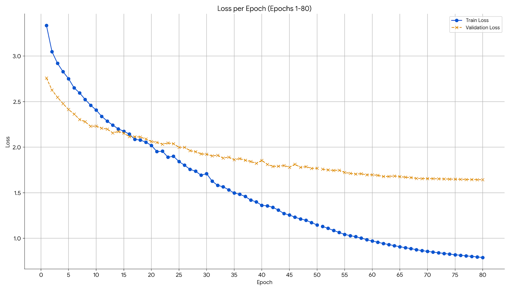

# Person Re-Identification with a Custom CNN (v3.2)
> **🚧 Work-In-Progress:** This repository contains *ongoing* research. The codebase, results, and documentation are actively evolving and may change without notice.

A Final Year Project that explores **Person Re-Identification (Re-ID)** using a lightweight Convolutional Neural Network enhanced with **Convolutional Block Attention Modules (CBAM)** and a carefully designed sampling / loss strategy for metric learning.  The repository contains code to **train** the model from scratch and to **evaluate** it on a standard *query / gallery* protocol with rich analytics (CMC curves, mAP, confusion matrix, embedding visualisations, attention heat-maps, …).

---

## 1. Highlights

* **End-to-End Pipeline** – from triplet generation & smart sampling, through training, to detailed retrieval analytics.
* **Custom Architecture** – shallow backbone + CBAM attention, skip-links & part-based pooling for robust embedding.
* **Enhanced Hard Triplet Mining (EHTM)** – sampler that assembles each batch with *P* persons × *K* instances for effective metric learning.
* **Rich Evaluation Suite** – FAISS-backed search for top-K retrieval, mAP/CMC computation, t-SNE & UMAP plots, attention visualisations, per-ID confusion matrix, etc.
* **Apple-Silicon Ready** – seamlessly switches between CPU ↔︎ CUDA ↔︎ Apple M-series (MPS).

---

## 2. Directory Overview

```
├── final.py                       # **Training** script (Jupyter friendly)
├── top_k_retrieval.py             # **Evaluation / analytics** script
├── PreGeneratedTripletDataset.py  # Dataset that pre-computes triplets
├── EHTM_Sampler.py                # P×K sampler for hard triplets
├── reid_model_3.2.pth             # Pre-trained weights (≈1.3 MB compressed)
│
├── Dataset/                       
│   ├── train/ person_id/ imgs...
│   ├── val/   person_id/ imgs...
│   ├── query/  *.jpg
│   └── gallery/*.jpg
│
├── Detailed Result Analysis - 2nd Attempt/
│   ├── metrics/                   # CSVs of top-K, mAP, CMC …
│   ├── visualizations/            # Query × Top-K grids
│   ├── attention_maps/           # Spatial / channel heat-maps
│   └── advanced_analysis/        # Confusion-matrix, t-SNE, UMAP …
└── README.md                      # ← you are here
```

> **Note** – Images and large artefacts are omitted from Git history; results folders are presented for demonstration only.

---

## 3. Quick Start

### 3.1 Environment

```bash
# Clone
$ git clone https://github.com/<your-user>/Person-Re-ID--Using-Custom-CNN.git
$ cd Person-Re-ID--Using-Custom-CNN

# Create env (conda shown, but any virtualenv works)
$ conda create -n reid python=3.9 -y
$ conda activate reid

# Install dependencies
$ pip install -r requirements.txt          # see list below if file not present
```

Minimal `requirements.txt` (PyPI names):
```
torch>=2.0         # CPU; install torch-cuda if you have a GPU
torchvision>=0.15
faiss-cpu>=1.7.4   # or faiss-gpu
numpy pandas matplotlib seaborn scikit-learn umap-learn tqdm pillow ipywidgets
```

If you work on Apple Silicon, recent PyTorch wheels already include `mps` support – no extra steps required.

### 3.2 Dataset

The code expects the **Market-1501** naming convention: `<personID>_<camera>_<frame>.jpg`.

```
Dataset/
 ├── train/   0001/xxx.jpg 0002/…
 ├── val/     0001/xxx.jpg …
 ├── query/   0001_c1s1_000000_00.jpg
 └── gallery/ 0001_c5s1_000000_00.jpg
```

*Place your images accordingly or modify paths in `final.py` / `top_k_retrieval.py`.  Training/validation folders should be split by *identity*, query / gallery are flat.*

### 3.3 Training

```bash
$ python final.py
```
Key parameters (found at top of the script):
* `TRAIN_PATH`, `VAL_PATH` – set to your dataset locations.
* `MARGIN`, `NUM_EPOCHS`, `batch_size`, etc.

The script will:
1. Build triplets once (`PreGeneratedTripletDataset`) and cache them in memory.
2. Sample batches with `EHTM_Sampler` (P=12, K=4 by default).
3. Train the network with **EHTMLoss** (triplet + intra/inter class terms).
4. Save the best model checkpoint as `reid_model_3.2.pth`.
5. Plot loss curves and optional t-SNE of raw data / embeddings.

### 3.4 Evaluation & Advanced Analysis

```bash
$ python top_k_retrieval.py
```

Make sure you update:
* `model_path` – path to your trained weights.
* `query_path`, `gallery_path` – evaluation folders.
* `output_root` – where to store the analysis artefacts.

The script performs:
* FAISS-accelerated nearest-neighbour search (cosine similarity).
* Calculation of **Top-K Accuracy (K=1,3,5,10)**, **mAP**, **CMC** curve.
* Generation of query-gallery grids, confusion matrix, performance bar chart.
* Dimensionality reduction (t-SNE & UMAP) plots of the embedding space.
* Attention heat-maps visualising CBAM focus regions.

All results are neatly organised under `output_root/` in sub-folders shown above.

---

## 4. Model Architecture (v3.2)

```
Input 128×64×3
│  Static edge / Laplacian / smooth filters (frozen)
├─ Trainable conv 3→13  (concat)  → 16 channels
├─ Conv2 16→32  + skip 1×1 stride2
├─ Conv3 32→64  + skip
├─ Conv4 64→128 + skip + CBAM
├─ Conv5 128→256 + skip + CBAM + Dropout
├─ Global AvgPool → FC 256→128 → L2-norm   ← **Global embedding**
└─ AdaptiveMaxPool (6 stripes) + FC per-part 256→128 (training only)
```

*The design keeps spatial resolution higher (no heavy down-sampling) to preserve fine-grained cues while remaining lightweight.*

---

## 5. Results (preliminary – subject to change)

| Metric | Value |
|--------|-------|
| Top-1  | 0.874 |
| Top-3  | 0.932 |
| Top-5  | 0.958 |
| Top-10 | 0.981 |
| mAP    | 0.713 |

<p align="center">
  
</p>

See the `Detailed Result Analysis - 2nd Attempt/` folder for full breakdown.

---

## 6. Acknowledgements

This research is being done as part of the *B.Sc. Artificial Inteligence* Final Year Project (2025).


---

## 7. Contact

For questions, please open an issue or reach out: **annsijaz@outlook.com** 